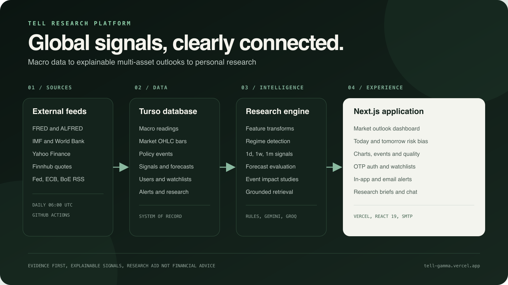

# Tell

Global activity → market outlook research platform.



Documentation: [index](docs/README.md) · [architecture](docs/ARCHITECTURE.md) · [data model](docs/DATA-MODEL.md) · [signals](docs/SIGNALS.md) · [API](docs/API.md) · [auth and email](docs/AUTH-AND-EMAIL.md) · [security](docs/SECURITY.md) · [operations](docs/OPERATIONS.md)

## Stack

- Next.js (Vercel)
- Turso
- GitHub Actions (CI + daily ingest)
- Free data + Gemini / Groq

## Setup

```bash
cp .env.example .env   # fill secrets
make setup             # install + migrate + seed
make dev
```

Or with npm:

```bash
npm install
npm run db:migrate
npm run db:seed
npm run dev
```

Never commit `.env`.

## Ingest

```bash
make ingest-fred       # US macro from FRED → Turso readings
make ingest-markets    # Asset OHLC from Yahoo Finance → Turso asset_readings
make ingest-events     # Fed / ECB / BoE RSS → Turso events
make ingest-manual     # IMF DataMapper cross-country (run on your machine)
make ingest-all        # FRED + IMF (manual) + markets + events locally
```

`make ingest-manual` pulls **true IMF WEO** when you can (DataMapper is often blocked
from GitHub cloud IPs). Run it whenever you want — daily, weekly, or after WEO updates.
Requires `.env` with Turso credentials (no IMF API key).

`make ingest-events` pulls free central-bank RSS (no API key). Keyword tags add a light
hawkish/dovish tilt and likely asset relevance for the dashboard + AI context.

`GET /api/events/impact` (and the dashboard **Event impact study** panel) measures median
forward returns at 1d / 1w / 1m after similar Fed/ECB/BoE releases. Optional
`sentiment=hawkish|dovish`. Historical analogues only — not predictions.

Optional: set `FRED_OBSERVATION_START`, `IMF_MIN_YEAR`, or `MARKET_OBSERVATION_START=2023-01-01` in `.env`.

## Features / regimes

```bash
make compute-features   # US macro + market features + regime snapshot from Turso
```

Optional: `FEATURE_AS_OF=2024-06-01` or `FEATURE_SYMBOLS=SPY,TLT,GLD` in the environment.
Pure TypeScript transforms (no ML). Used as inputs for the signal engine.

## Signals

```bash
make compute-signals   # Write bullish/neutral/bearish outlooks to Turso
make compute-forecasts # Score resolved signals into forecast_log (hit rate)
make backfill-signals  # Recompute last N trading days of signals + forecasts
make compute-alerts    # Evaluate watchlist alert rules → in-app inbox
```

Defaults: horizons `1d,1w,1m` (≈ 1 / 5 / 21 trading sessions). Custom day horizons:

```bash
SIGNAL_HORIZONS=1d,1w,1m,10d,60d make compute-signals
```

Hourly horizons are not supported yet (daily bars only). Near-real-time **last price**
overlay uses Finnhub quote when `FINNHUB_API_KEY` is set, else Yahoo — printed by
`compute-signals` for context; scores still use daily features.

`compute-forecasts` compares each stored signal to the realized forward return once
enough bars exist. Neutral is graded with a small band that widens with horizon length.
Daily Actions runs this after `compute:signals` (no AI keys).

`make backfill-signals` walks recent SPY trading days (default `BACKFILL_DAYS=90`),
upserts historical `signals`, then evaluates `forecast_log` so quality hit rates have
real sample size. Optional: `BACKFILL_FROM` / `BACKFILL_TO`, `FORECAST_SYMBOLS`,
`BACKFILL_SKIP_FORECASTS=1`. Prefer local/occasional runs after rule changes, not
every daily CI job. FRED ingest also stores ALFRED vintages for key US
series (`CPI`, `UNRATE`, `INDPRO`, `GDP`); live features still read `vintage=current`.

`compute-alerts` checks enabled rules (direction flip, became direction, confidence
below) against the latest signals and writes unread `alert_events` (and emails when
SMTP is configured). First observation after creating a rule is a baseline only (no
false fire).

`make compute-watchlist-briefs` builds a Gemini brief per user with a non-empty
watchlist and emails it when SMTP is configured.

## Daily ingest (GitHub Actions)

Workflow: `.github/workflows/ingest.yml`

- Runs **four times daily** at **00:00**, **06:00**, **12:00**, and **18:00 UTC**, plus **Actions → Daily ingest → Run workflow**
- Pipeline: **migrate → FRED → cross-country (World Bank on Actions) → Yahoo markets → policy RSS → signals → forecasts → alerts**
- Kept to four runs/day so free Yahoo/FRED/World Bank usage stays polite (hourly would risk Yahoo throttling with little new daily-bar data)
- If you miss `make ingest-manual`, Actions still fills cross-country via World Bank
- If you *did* run manual IMF, later World Bank runs **do not overwrite** those WEO rows

**Still local-only** (not on the cron):

| Command | Why |
| ------- | --- |
| `make ingest-manual` | IMF DataMapper is often blocked from GitHub IPs |
| `make compute-features` | Diagnostic printout only |
| `make backfill-signals` | Heavy historical rebuild; would hammer Yahoo |
| `make compute-briefs` / `make compute-watchlist-briefs` | Paid Gemini usage |

Repo secrets (Settings → Secrets and variables → Actions):

| Secret | Required for |
| ------ | ------------ |
| `TURSO_DATABASE_URL` | ingest + e2e |
| `TURSO_AUTH_TOKEN` | ingest + e2e |
| `FRED_API_KEY` | FRED ingest |
| `JWT_SECRET` | e2e only |

Optional repo **variables** are not required; scripts use built-in start defaults (`2015` / `2023-01-01`). Override locally via `.env` if needed.

## Quality

```bash
make lint
make format-check
make typecheck
make test
make test-e2e          # Playwright (needs .env for full auth flows)
make ci                # lint + format + types + unit + build + e2e
make help              # list all make targets
```

First time for Playwright browsers:

```bash
make install-browsers
# or: npx playwright install chromium
```

Then:

```bash
make ci
```

CI runs on every push/PR to `main` via GitHub Actions (unit + e2e).
Daily data refresh is a separate scheduled workflow (see above).
For full auth e2e in CI, add repo secrets: `JWT_SECRET`, `TURSO_DATABASE_URL`, `TURSO_AUTH_TOKEN`.

## Auth

- App pages require a session; `/` and `/methodology` redirect to `/login` when signed out
- Public: `/login`, `/register`, `/docs` (Swagger UI), `/api/openapi`
- `/register` (username + email OTP + confirm password) · `/login` (email or username)
- Cookie JWT (`AUTH_COOKIE_NAME`, default `tell_session`) backed by Turso `users`
- Registration requires email OTP (`REGISTRATION_ENABLED`, `EMAIL_OTP_ENABLED`, SMTP)
- APIs: `/api/auth/otp/request` · `/api/auth/otp/verify` · `login` · `logout` · `me`
  (`POST /api/auth/register` is disabled; email verification is required)
- SMTP: `SMTP_HOST`, `SMTP_PORT`, `SMTP_USER`, `SMTP_PASSWORD`, `SMTP_FROM`,
  `SMTP_USE_TLS`, plus `OTP_EXPIRE_MINUTES` / `OTP_LENGTH`
- Watchlist (signed-in): `GET/POST/DELETE /api/watchlist` — saved symbols filter the dashboard by default when non-empty
- Alerts (signed-in): `GET/POST /api/alerts`, `PATCH/DELETE /api/alerts/rules/:id`, `POST /api/alerts/read` — rules on watchlist symbols; in-app inbox + email after daily evaluate

## Read APIs

Public JSON endpoints (Turso-backed):

| Route | Purpose |
| ----- | ------- |
| `GET /api/health` | App + config + DB + data counts (`?deep=1` probes Yahoo/Finnhub). Signed-in UI: `/system` |
| `GET /api/ready` | Same as health (deploy / uptime readiness probe) |
| `GET /api/assets` | Asset universe |
| `GET /api/outlook` | Latest signals (`?symbols=SPY,TLT&horizons=1d,1w&asOf=YYYY-MM-DD`) |
| `GET /api/outlook/SPY` | One asset (`?live=1` adds near-real-time quote) |
| `GET /api/charts/SPY` | Daily OHLC series + signal markers (`?horizon=1d&limit=90`) |
| `GET /api/quality` | Signal hit-rate report (`?symbol=SPY`) |
| `GET /api/events` | Policy events (`?source=Fed&country=US&symbol=SPY&since=YYYY-MM-DD&limit=30`) |
| `GET /api/events/impact` | Historical forward returns after similar events (`?symbol=SPY&source=Fed&sentiment=any`) |
| `GET /api/macro/strip` | US CPI / curve / VIX sparkline strip (`?limit=24`) |
| `GET /api/risk/near-term` | Today / tomorrow risk-on, mixed, or risk-off ensemble bias |
| `GET /api/readings?country=US&indicator=CPI` | Macro series (`from`/`to`/`limit`) |

## AI (Gemini + Groq)

Optional research layer on top of Turso signals and macro readings.

| Route | Purpose |
| ----- | ------- |
| `GET /api/brief?symbol=SPY&horizon=1d` | Gemini brief with prior delta (`&refresh=1` regenerates + upserts) |
| `GET /api/brief/history?symbol=SPY&horizon=1d&limit=7` | Stored brief history from Turso |
| `POST /api/chat` | Groq Q&A grounded in latest evidence (`{ message, history?, symbol?, horizon? }`) |

```bash
make compute-briefs   # Persist Gemini briefs for the asset universe
```

Optional: `BRIEF_SYMBOLS=SPY,TLT`, `BRIEF_HORIZONS=1d,1w`, `BRIEF_DELAY_MS=500`.

Set `GEMINI_API_KEY` and `GROQ_API_KEY` in `.env`. Optional: `GEMINI_MODEL` (default `gemini-3.1-flash-lite`, with fallbacks), `GROQ_MODEL`.
Without keys, endpoints return `503` and the UI shows a soft unavailable state.

Dashboard: evidence panel includes a **Gemini brief** with vs-prior delta; header **Ask Tell** opens Groq chat.

Daily Actions ingest runs data + `compute:signals` only. Keep `GEMINI_API_KEY` /
`GROQ_API_KEY` out of Actions secrets; run briefs and live evals locally:

```bash
make compute-briefs
TELL_AI_EVAL=1 make test-eval
```

Offline AI evals (mocked, no API keys) still run in `npm test`.

After pulling schema changes:

```bash
make db-migrate
```

## Disclaimer

Not financial advice. Research tool only.

See live product copy on [`/methodology`](https://tell-gamma.vercel.app/methodology) — how regimes, `rules-v1` signals, hit rates, events, and AI grounding work.
