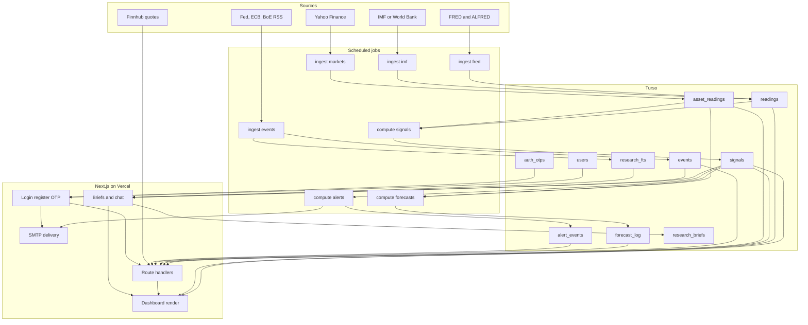

# Architecture


Tell separates three concerns: data collection, offline scoring, and request-time presentation. Anything expensive or rate-limited runs in scheduled scripts and lands in Turso; the web application only reads stored facts and adds optional language-model narration.

## Design principles

1. **Turso holds the truth.** Every number shown in the UI is traceable to a stored row.
2. **Scoring is deterministic.** Outlooks come from transparent rules (`rules-v1`), not opaque models.
3. **Language models explain, they do not predict.** Briefs and chat are grounded in retrieved evidence.
4. **The daily job stays cheap.** Only free data sources run on schedule; paid or key-limited AI work is manual.
5. **Every claim is measured.** Signals are graded against realized returns in `forecast_log`.

## Layers

| Layer | Responsibility | Location |
| ----- | -------------- | -------- |
| Persistence | Schema and client for Turso/libSQL | `db/schema.sql`, `src/lib/db.ts` |
| Reference data | Countries, indicators, assets | `src/data/seed.ts` |
| Source adapters | HTTP clients for each provider | `src/lib/fred.ts`, `imf.ts`, `worldbank.ts`, `yahoo.ts`, `quotes.ts`, `rss.ts` |
| Ingestion | CLI jobs that upsert provider data | `scripts/ingest-*.ts` |
| Feature engine | Pure transforms over stored series | `src/lib/features/*` |
| Signal engine | Rule scoring and persistence | `src/lib/signals/*` |
| Evaluation | Forward returns and hit rates | `src/lib/forecasts/*` |
| Product domains | Events, alerts, watchlist, macro, risk, AI | `src/lib/{events,alerts,watchlist,macro,risk,ai}/*` |
| HTTP surface | Route handlers and query services | `src/app/api/**`, `src/lib/api/*` |
| Interface | Server-rendered dashboard and panels | `src/app/*`, `src/components/*` |
| Identity and delivery | Sessions (email/username JWT), OTP, SMTP | `src/lib/auth.ts`, `src/lib/auth/otp.ts`, `src/lib/email/*` |

## Data flow



## Request paths

The home page is `force-dynamic` and reads Turso directly during server rendering, so first paint needs no client fetch:

```ts
// src/app/page.tsx
const [signals, watchlist, macroStrip, nearTermBias] = await Promise.all([
  listLatestOutlook(db),
  session ? listWatchlist(db, session.sub) : Promise.resolve([]),
  getMacroStrip(db, { limit: 24 }),
  getNearTermRiskBias(db),
]);
```

Interactive panels then call the API for detail: charts, event impact, forecast quality, alerts, briefs, and chat. Live quotes are fetched only when explicitly requested with `?live=1`, and a quote failure never fails the outlook response.

## Offline pipeline

| Step | Command | Writes |
| ---- | ------- | ------ |
| 1 | `npm run ingest:fred` | `readings` (current vintage plus ALFRED vintages for priority series) |
| 2 | `npm run ingest:imf` | `readings` for cross-country indicators |
| 3 | `npm run ingest:markets` | `asset_readings` |
| 4 | `npm run ingest:events` | `events`, `research_fts` |
| 5 | `npm run compute:signals` | `signals` |
| 6 | `npm run compute:forecasts` | `forecast_log` |
| 7 | `npm run compute:alerts` | `alert_events`, alert email |

Manual, key-dependent extras:

| Command | Purpose |
| ------- | ------- |
| `npm run backfill:signals` | Rebuild historical signals so hit rates have sample size |
| `npm run compute:briefs` | Persist Gemini briefs for the universe |
| `npm run compute:watchlist-briefs` | Per-user watchlist brief plus email |
| `npm run test:eval` | Live model quality eval, gated by `TELL_AI_EVAL=1` |

`compute:features` prints a diagnostic snapshot; production scoring builds features inside `compute:signals`.

## Repository layout

```text
tell/
├── .github/workflows/
│   ├── ci.yml                        # lint, format, types, unit, build, e2e
│   └── ingest.yml                    # daily 06:00 UTC pipeline
├── db/schema.sql                     # Turso schema, idempotent
├── docs/                             # documentation + architecture diagram
│   ├── tell-architecture.svg
│   └── tell-architecture.png
├── e2e/                              # Playwright specs
├── scripts/                          # CLI pipeline entry points
│   ├── migrate.ts  seed.ts
│   ├── ingest-fred.ts  ingest-imf.ts  ingest-markets.ts  ingest-events.ts
│   ├── compute-features.ts  compute-signals.ts  compute-forecasts.ts
│   ├── compute-alerts.ts  compute-briefs.ts  compute-watchlist-briefs.ts
│   ├── backfill-signals.ts  eval-ai.ts
├── src/
│   ├── proxy.ts                      # rate-limits + JWT auth for every /api/*
│   ├── app/
│   │   ├── page.tsx                  # dashboard, server rendered
│   │   ├── login/  register/  methodology/
│   │   ├── error.tsx  loading.tsx  layout.tsx  globals.css
│   │   └── api/                      # 25 route handlers
│   ├── components/                   # dashboard and panels
│   ├── data/seed.ts                  # countries, indicators, assets
│   └── lib/
│       ├── ai/                       # brief, chat, context, rag, cache, rate limit
│       ├── alerts/                   # rule evaluation and store
│       ├── api/                      # outlook, charts, health, readings, http
│       ├── auth/                     # OTP lifecycle
│       ├── email/                    # mailer and templates
│       ├── events/                   # ingest, enrich, impact, store
│       ├── features/                 # macro, market, regime, series, stats
│       ├── forecasts/                # forward return and quality
│       ├── macro/                    # sparkline strip
│       ├── risk/                     # near-term bias
│       ├── signals/                  # score, horizons, backfill, store
│       ├── watchlist/                # user symbol store
│       ├── auth.ts  db.ts  password.ts  session-token.ts
│       └── fred.ts  imf.ts  worldbank.ts  yahoo.ts  quotes.ts  rss.ts
├── .env.example  Makefile  package.json  README.md
├── playwright.config.ts  vitest.config.mts  vitest.setup.ts
└── next.config.ts  tsconfig.json  eslint.config.mjs
```

## Asset universe

Seeded countries: `US`, `IN`, `DE`, `JP`, `GB`, `CN`.

| Class | Symbols |
| ----- | ------- |
| Equity | `SPY`, `INDA`, `EWG`, `EWJ`, `EWU`, `MCHI` |
| FX | `EURUSD`, `GBPUSD`, `USDJPY`, `USDCNH` |
| Commodity | `GLD`, `USO` |
| Rates | `TLT` |

## Runtime dependencies

| Concern | Dependency | Required |
| ------- | ---------- | -------- |
| Hosting | Vercel, Next.js 16.3, React 19 | Yes |
| Database | Turso through `@libsql/client` | Yes |
| Sessions | `JWT_SECRET` with `jose`, `bcryptjs` hashes | Yes |
| US macro | FRED with `FRED_API_KEY` | For ingest |
| Cross-country macro | IMF DataMapper, World Bank fallback | No key |
| Market bars | Yahoo Finance | No key |
| Live quotes | Finnhub with `FINNHUB_API_KEY` | Optional |
| Policy events | Fed, ECB, BoE RSS | No key |
| Briefs and chat | `GEMINI_API_KEY`, `GROQ_API_KEY` | Optional |
| Email | SMTP through Nodemailer | Needed for OTP registration |
| CI | Node 22, Playwright Chromium | Yes |

## Failure behavior

| Condition | Result |
| --------- | ------ |
| Missing AI keys | Brief and chat endpoints return `503`; UI shows an unavailable state |
| Missing SMTP | OTP requests return `503` unless local `TELL_OTP_DEV_ECHO=1` (blocked when `APP_ENV` is production-like); alert email is skipped, inbox still written |
| Live quote failure / `LIVE_MARKET_QUOTES=false` | Outlook still returns with `quote: null` |
| IMF blocked from cloud IPs | Cross-country ingest falls back to World Bank and preserves existing IMF rows |
| `research_fts` not migrated | Retrieval indexing is skipped silently |
| Missing required env | `/api/health` and `/api/ready` return `503` with the missing names |

Related reading: [Data model](DATA-MODEL.md), [Signal methodology](SIGNALS.md), [API reference](API.md), [Operations](OPERATIONS.md).
